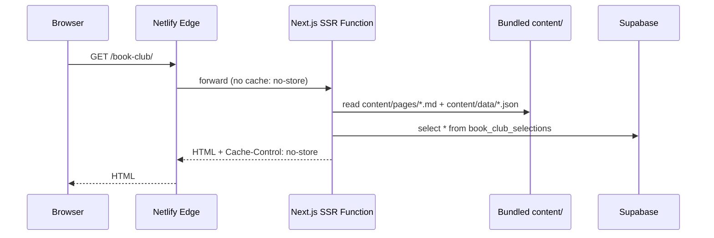
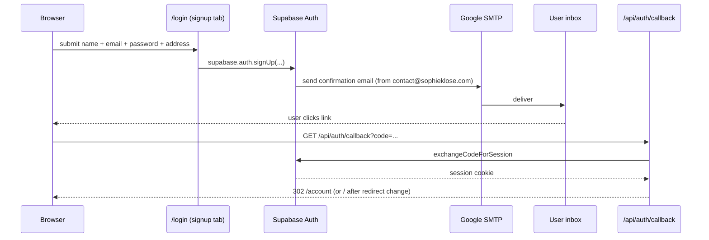
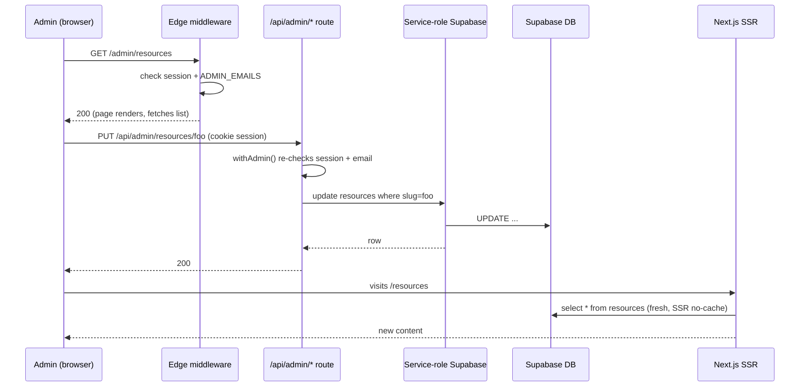

# sophieklose.com — Technical Documentation

Audience: future maintainers (assumes basic familiarity with Next.js, Git, and serverless concepts).
Last updated: 2026-06-21.

If anything here drifts from the code, the code wins. Update this doc in the same PR as the change.

---

## 1. Overview

Counselling practice website for Sophie Klose. Static-feeling marketing site (home, about, services, contact) plus a small DB-backed catalogue (curated resources, monthly book club selections), email+password user accounts, and a self-built admin UI for content edits.

- **Live URL**: https://sophieklose.com
- **Repo**: https://github.com/sophieklose-git/sophieklose-website
- **Hosting**: Netlify project `sophieklose-website` (account `sophieklose-git`)
- **Backing DB / Auth**: Supabase project `https://hdggcruzisotvmmzetwg.supabase.co`

This is a phased rebuild of an earlier static HTML site. Phases 0–10 (intake → cutover) are complete; Phase 11a/c/d (auth, resources to DB, book club to DB) are live. Phase 11b (webinars to DB) is deferred until real video content exists. Cutover from the old project to this one happened 2026-06-20.

---

## 2. Architecture at a glance

### Overview

```mermaid
graph LR
    Browser((Browser))
    Browser -->|HTTPS| NetlifyCDN[Netlify Edge / CDN]
    NetlifyCDN -->|SSR request| NetlifyFn[Netlify Function<br/>Next.js SSR]
    NetlifyFn -->|REST / auth| Supabase[(Supabase<br/>Postgres + Auth)]
    NetlifyFn -->|reads| ContentFiles[content/*.md, *.json<br/>bundled with function]
    Browser -->|/__forms.html POST| NetlifyForms[Netlify Forms]
    NetlifyForms -->|notify| Sophie[contact@sophieklose.com]
    Supabase -->|auth emails via SMTP| GoogleSMTP[Google Workspace SMTP<br/>smtp.gmail.com:465]
    GoogleSMTP --> UserInbox((User inbox))
    GitHub[GitHub<br/>sophieklose-git/sophieklose-website] -->|push to main| NetlifyBuild[Netlify Build]
    NetlifyBuild -->|deploys| NetlifyCDN
    Browser -.->|DNS lookup| NetlifyDNS[Netlify DNS<br/>NS1 nameservers]
```

### Page-render flow

Used for every page hit, public or admin. See §7.



### Auth flow (sign-up)



### Admin edit flow



---

## 3. Tech stack

| Layer | Choice | Why |
|---|---|---|
| Framework | **Next.js 15** (Pages Router) | Inherited from netlify-templates/content-ops-starter. Hybrid SSG+SSR fit well. Pages Router was already wired up; not worth migrating to App Router. |
| Language | TypeScript (most code), some legacy JS in starter files | Project chose to add TS gradually rather than convert wholesale. |
| Styling | **Tailwind CSS** + a small set of custom colors in `tailwind.config.js` | Matches starter; speed of iteration. |
| Content (marketing pages) | **Git CMS** via local markdown + JSON in `content/` | Per Phase 4 decision: free, versioned, simple. |
| Content (catalogues) | **Supabase Postgres** (`resources`, `book_club_selections`) | Per Phase 11 plan: needs admin UI, monthly rotation, no rebuild required. |
| Auth | **Supabase Auth** (email+password) | Free tier covers expected volume; Google SSO deferred. |
| Hosting | **Netlify** (build, CDN, functions, forms) | Single platform, generous free tier, native Next.js plugin. |
| DNS | **Netlify DNS** (nameservers `*.p09.nsone.net`) | Already on Netlify; no separate registrar DNS panel needed. |
| Auth email transport | **Google Workspace SMTP** (smtp.gmail.com:465) | sophieklose.com mailbox already on Workspace; no extra service. |
| Contact form | **Netlify Forms** (built-in notifications) | Free for low volume, no code. |
| Versioning / CI trigger | **GitHub** (account `sophieklose-git`) | Push to `main` triggers Netlify auto-build. |

Key libraries: `@supabase/supabase-js`, `@supabase/ssr` (cookie-based session handling), `markdown-to-jsx`, `front-matter`, `glob`, `next/font/google` (Cormorant Garamond + Jost).

---

## 4. Third-party services & accounts

| Service | Role | Account / project | Plan | Login | What breaks if it's down |
|---|---|---|---|---|---|
| **Netlify** | Build + CDN + Functions + Forms + DNS | Team owning `sophieklose-website` project (account formerly `sophieklose-git`) | Free tier | https://app.netlify.com | Whole site offline; forms stop accepting; admin API down |
| **Supabase** | Postgres DB + Auth | Project `hdggcruzisotvmmzetwg` (EU region) | Free tier | https://app.supabase.com | `/resources` and `/book-club` page renders fail (catch in SSR will likely 500); auth login/signup broken |
| **Google Workspace** | Mailbox + SMTP relay for auth emails | sophieklose.com Workspace | Paid (existing) | https://admin.google.com | Auth confirmation / reset emails stop sending; existing sessions unaffected |
| **GitHub** | Source of truth, CI trigger | Org `sophieklose-git`, repo `sophieklose-website` | Free | https://github.com/sophieklose-git/sophieklose-website | Can't deploy new versions; existing site keeps running |
| **Domain registrar** | Owns `sophieklose.com` | _(check registrar from `whois sophieklose.com` if needed)_ | Annual renewal | — | Domain expires → DNS resolution fails entirely |

**Credentials live in:**
- Local: `.env.local` (gitignored)
- Production: Netlify → Site configuration → Environment variables
- The Supabase service-role key is marked "Secret" in Netlify; everything else is plain
- App passwords (Google SMTP) live inside Supabase Auth → SMTP Settings only

---

## 5. Repository tour

```
sophieklose-website/
├── content/                  # Git CMS — marketing pages + global config
│   ├── pages/                # *.md page files (home, about, etc.)
│   └── data/                 # site.json, header.json, footer.json, style.json
├── public/                   # Static assets served as-is
│   ├── images/               # All page imagery (jpg, webp, png)
│   ├── pdfs/                 # Bundled PDFs (Sophie's thesis etc.)
│   └── __forms.html          # Netlify Forms scaffold (required by plugin v5)
├── scripts/                  # One-shot Node scripts
│   ├── import-resources.mjs  # Seed/reseed resources from JSON
│   ├── seed-book-club.mjs    # Seed The Stoic Challenge
│   └── compress-hero-images.mjs
├── sources/local/models/     # Stackbit content model definitions (one per section type)
├── src/
│   ├── components/
│   │   ├── admin/AdminLayout.tsx
│   │   ├── blocks/           # Reusable atoms (Image, Form, etc.)
│   │   ├── layouts/          # DefaultBaseLayout (header + page + footer), PageLayout
│   │   └── sections/         # All section components (Header, Footer, GenericSection, ...)
│   ├── lib/
│   │   ├── admin.ts          # isAdminEmail(), createServiceClient()
│   │   ├── admin-api.ts      # withAdmin() handler wrapper
│   │   └── supabase/         # client.ts (browser), server.ts (SSR cookie-based)
│   ├── pages/
│   │   ├── [[...slug]].js    # SSR catch-all; renders every public page
│   │   ├── _app.js, _document.js
│   │   ├── admin/            # Admin UI (gated by middleware)
│   │   ├── api/              # API routes (auth callback + admin CRUD)
│   │   ├── account.tsx       # Gated user page
│   │   ├── login.tsx         # Signin / signup / reset on one page
│   │   └── reset-password.tsx
│   ├── middleware.ts         # Edge middleware: gates /account/* and /admin/*
│   └── utils/                # local-content, page-utils, seo-utils, etc.
├── supabase/migrations/      # Hand-applied SQL (Supabase Studio); kept for source-of-truth
├── netlify.toml              # Build settings + .html→clean URL redirects
├── next.config.js            # outputFileTracingIncludes, trailingSlash, allowedDevOrigins
├── stackbit.config.ts        # Netlify Visual Editor config (siteMap, models)
└── tailwind.config.js
```

**"If you want to change X, look here":**
- Page copy / images on a marketing page → `content/pages/<page>.md`
- Header nav links or tagline → `content/data/header.json` (or via Visual Editor)
- Footer copy / link groups → `content/data/footer.json`
- Brand colors / fonts → `tailwind.config.js` + `content/data/style.json`
- A section's HTML / styling → `src/components/sections/<SectionName>/index.tsx`
- A new section type → add model in `sources/local/models/`, component in `src/components/sections/`, register in `components-registry.ts` and `PageLayout.ts` allowlist
- Resource / book club data → Supabase Studio (or `/admin`)
- A new Supabase table → SQL file in `supabase/migrations/` + paste into Supabase SQL Editor

---

## 6. Content & data model

### Git CMS (in repo)

Loaded synchronously at request time by `src/utils/local-content.ts` (`allContent()`). Files are bundled with the SSR function via `outputFileTracingIncludes` in `next.config.js`.

| Type | Location | Purpose |
|---|---|---|
| Page | `content/pages/*.md` | Each file = one route. Frontmatter declares `slug`, `sections[]`, `seo`. Body is unused. |
| Site config | `content/data/site.json` | References `header.json`, `footer.json`, favicon, default social image. |
| Header / Footer | `content/data/header.json`, `footer.json` | Global nav + footer. Edited via Visual Editor or directly. |
| Theme | `content/data/style.json` | Tailwind tokens used by `_document.js`. |

Cross-file references use relative-path strings, e.g. `"header": "content/data/header.json"`. `local-content.ts:resolveReferences` walks the object tree and swaps string refs for the actual loaded object. File IDs are computed as `path.relative(process.cwd(), file)` so refs resolve in dev and inside the bundled function.

### Supabase tables

All migrations live in `supabase/migrations/*.sql`. RLS is enabled on every table; public-read where applicable; mutations go through API routes using the service-role key.

#### `resources`

```sql
id uuid PK, slug text unique, title text, tag text,
description text, link_label text, link_url text,
group_slug text, sort_order int,
created_at timestamptz, updated_at timestamptz
```

- **RLS**: public can SELECT all rows. Inserts/updates/deletes require service role.
- **Read by**: `[[...slug]].js` getServerSideProps → fetches all, injects into `data.objects`, the `ResourceGroupSection` resolver filters by `group_slug` matching the section's `group` prop.
- **Write by**: `/api/admin/resources` (POST), `/api/admin/resources/[slug]` (PUT, DELETE), and `scripts/import-resources.mjs` (one-shot reseed).
- **Group values** are an enum hardcoded in the admin UI: `caring-for-adolescents`, `parenting-digital-world`, `neurodiversity-adhd`, `insights-neuroscience`, `other-helpful-resources`.

#### `book_club_selections`

```sql
id uuid PK, slug text unique, selection_month date,
title text, author text,
cover_url text, purchase_url text, purchase_label text,
intro_md text, reflection_md text nullable,
is_published boolean default true,
created_at timestamptz, updated_at timestamptz
```

- **RLS**: public can SELECT rows where `is_published = true`. Mutations require service role.
- **Read by**: `[[...slug]].js` SSR. `BookClubSelectionsSection` component renders newest-first.
- **Write by**: `/api/admin/book-club` + `/api/admin/book-club/[slug]`, and `scripts/seed-book-club.mjs`.
- `selection_month` is the first of the month (e.g. `2026-05-01`) and drives display order.

#### `auth.users` (Supabase-managed)

Standard Supabase Auth table. Custom signup fields live in `raw_user_meta_data` JSONB:
`first_name, last_name, street, number, postcode, city, country, marketing_consent`.

Read via `supabase.auth.admin.listUsers()` in `/api/admin/users` for the admin Users view. Not directly queried elsewhere.

### Decision: what lives where, and why

- **Marketing pages** stay in Git CMS because they change rarely and benefit from version history + the Visual Editor.
- **Catalogues** (resources, book club) moved to Supabase because they need an admin UI without a redeploy, and because they grow over time.
- **Webinars** are still in `content/pages/webinars.md` as placeholders. Deferred until real content exists.
- **PDFs** (Sophie's thesis) live in `public/pdfs/` because they're small, immutable, and benefit from CDN edge caching.

---

## 7. Page rendering pipeline

All public routes (and `/account`) go through one file: `src/pages/[[...slug]].js`.

1. Browser requests, say, `/book-club/`.
2. Netlify Edge cache is bypassed (response sets `no-store`, request matches no static file).
3. Request enters the SSR Netlify Function.
4. `getServerSideProps`:
   - Sets `Cache-Control: no-store, max-age=0, must-revalidate` and `Netlify-CDN-Cache-Control: no-store`.
   - Calls `allContent()` → reads bundled `content/` files into in-memory objects, resolves cross-references.
   - In parallel, fetches `resources` and `book_club_selections` from Supabase using the anon key (RLS lets it read what's public).
   - Merges DB rows into `data.objects` as fake "Resource" / "BookClubSelectionRow" entries with `__metadata.modelName`.
   - `resolveStaticProps(urlPath, data)` finds the matching page object, walks its `sections[]`, and for each section runs the resolver in `static-props-resolvers.js` (e.g. `ResourceGroupSection` filters injected resources by group; `BookClubSelectionsSection` returns all selections).
   - Returns `{ props: { page, site } }`, or `{ notFound: true }` if no page matches the URL.
5. `Page` component picks the matching `PageLayout` model from `components-registry.ts`.
6. `PageLayout` renders inside `DefaultBaseLayout`, which wraps the page in `<Header>` and `<Footer>` (loaded from `site.header` / `site.footer` references).
7. Each `section` renders via dynamic import from the components registry.
8. HTML streams to the browser.

**Why SSR, not ISR/SSG?** Originally getStaticProps with `revalidate: 60`. Switched to SSR (`getServerSideProps`) on 2026-06-21 because on-demand revalidation (`res.revalidate()`) proved unreliable for catch-all routes on Netlify's @netlify/plugin-nextjs v5 — deleted/edited DB content kept serving stale from the Netlify Durable Cache. SSR + `no-store` headers avoid the cache layer entirely. Tradeoff: every page hit invokes a function (~50–200 ms). Fine at current traffic.

**Trailing slashes**: `trailingSlash: true` in `next.config.js`. `/book-club` 308-redirects to `/book-club/`.

---

## 8. Authentication & admin

### Auth basics

- **Single login page**: `/login` with three tabs (sign in, create account, reset).
- **Sessions**: cookie-based via `@supabase/ssr`. Server and browser both read the same cookie.
- **Email confirmation**: required on signup. Link points at `/api/auth/callback?code=...` → exchanges code for session → redirects to `/`.
- **Password reset**: link points at `/reset-password`.

### Gated routes (middleware)

`src/middleware.ts` runs on the edge for paths matching `['/account/:path*', '/admin/:path*']`.

- Unauthenticated → 302 `/login`.
- For `/admin/*`: additionally checks `user.email ∈ ADMIN_EMAILS`. If signed in but not admin → 302 `/account`.

### Admin UI

| Route | What it does |
|---|---|
| `/admin` | Overview with cards linking to the three sections |
| `/admin/resources` | Table grouped by `group_slug`; inline edit forms; create / delete |
| `/admin/book-club` | List newest-first; inline edit forms; supports adding `reflection_md` mid-month |
| `/admin/users` | Table of all signed-up users (first name, last name, email, registered, confirmed flag) |
| `/admin/users/[id]` | Detail view: identity, address, marketing consent, sign-in metadata |

The admin layout (`src/components/admin/AdminLayout.tsx`) supplies the top nav + "Back to site" + "Log out" links.

### Admin API

All mutations go through `/api/admin/*` routes wrapped by `withAdmin()` (in `src/lib/admin-api.ts`):

1. Reads the user's Supabase session from cookies.
2. Rejects with 401 if unauthenticated, 403 if email not in `ADMIN_EMAILS`.
3. Hands the handler a **service-role Supabase client** (`src/lib/admin.ts:createServiceClient`).

The service role bypasses RLS, so admin can write to tables that are otherwise read-only to anon. The service-role key is **server-only** — it never reaches the browser.

### Admin allowlist

`ADMIN_EMAILS` env var, comma-separated. Add more admins by appending emails.

---

## 9. Email

Two distinct flows, different transports:

### Auth emails (Supabase → Google SMTP)

- **Configured in**: Supabase dashboard → Authentication → Emails → SMTP Settings.
- **From**: `contact@sophieklose.com`.
- **SMTP host/port**: `smtp.gmail.com:465` (SSL).
- **Credentials**: a Google App Password generated against the `contact@sophieklose.com` Workspace account (requires 2-Step Verification on the account).
- **Templates**: edited in Supabase dashboard → Authentication → Emails → Templates. Variables like `{{ .ConfirmationURL }}`, `{{ .Token }}`, `{{ .SiteURL }}`.
- **Volume cap**: Google Workspace = 2,000 messages/day per account. Way above expected traffic. If approaching, switch to a transactional provider (Resend is the natural fallback — change SMTP host/port/credentials in Supabase, no code change).

### Contact form notifications (Netlify Forms)

- **Form name**: `contact-form` (declared in `public/__forms.html` per @netlify/plugin-nextjs v5 requirement).
- **Submit handler**: `src/components/blocks/FormBlock/index.tsx` posts the form to `/__forms.html` as `application/x-www-form-urlencoded`, then redirects to `/thank-you`.
- **Notifications**: Netlify dashboard → Project configuration → Notifications → Form submission notifications → email goes to `contact@sophieklose.com`. No code, no third-party email service.

---

## 10. Forms (Netlify Forms gotcha)

The @netlify/plugin-nextjs v5 form detection has a specific shape that you must follow or builds fail:

1. **Static scaffold required**: `public/__forms.html` must declare every form (hidden), including `name`, `data-netlify="true"`, and field names matching the live form. The plugin only scans this file.
2. **Submit must POST to `/__forms.html`** as `application/x-www-form-urlencoded` (not the rendered page path, not `action="/"`).
3. **Inline `data-netlify` in JSX is ignored** — and if you also try to submit via a normal form POST without overriding the handler, the build will fail with "Failed assembling static pages for upload".

Honeypot field: `bot-field`. Successful submission redirects to `/thank-you` (a page with `robots: noindex, nofollow`).

---

## 11. Environment variables

| Name | Where set | Secret? | Purpose |
|---|---|---|---|
| `NEXT_PUBLIC_SUPABASE_URL` | `.env.local` + Netlify | No | Supabase project URL. Used by both client and server. |
| `NEXT_PUBLIC_SUPABASE_ANON_KEY` | `.env.local` + Netlify | No | Anon key. Safe in client bundles. RLS enforces permissions. |
| `SUPABASE_SERVICE_ROLE_KEY` | `.env.local` + Netlify (marked Secret) | **Yes** | Bypasses RLS. Server-only — used by admin API routes and seed scripts. |
| `ADMIN_EMAILS` | `.env.local` + Netlify | No | Comma-separated email allowlist for `/admin/*`. |
| `STACKBIT_PREVIEW` | Set by Netlify Visual Editor build | No | Exposed to client via `env.stackbitPreview`. Used to toggle annotation rendering. |

**Operational notes:**
- Changes to Netlify env vars require a new build to take effect. Either push a commit or "Trigger deploy" from the Netlify UI.
- `.env.local` is gitignored. To onboard a new local dev environment, copy the values from `.env-example` (incomplete; ask for the real values) plus the four above.
- Scripts in `scripts/` use a tiny inline `.env.local` loader (no `dotenv` dep). They read `SUPABASE_SERVICE_ROLE_KEY` to bypass RLS during imports.

---

## 12. Deployment, rollback, backups

### Deploy

- **Auto-deploy**: push to `main` → Netlify build → live. Build takes ~2–4 minutes.
- **Manual deploy**: Netlify → Deploys → "Trigger deploy" → "Deploy site" (no code change). Use after editing env vars.
- **Build command**: `npm run build` (Next.js production build). Output: `.next` directory consumed by the @netlify/plugin-nextjs runtime.
- **Build minutes consumed**: every push or trigger uses build minutes (300/month on free tier). Batch changes; verify on localhost first.

### Rollback

Netlify → Deploys → find a previous good deploy → "Publish deploy". Reverts the live site to that deploy's HTML/JS bundle in seconds. Doesn't roll back Supabase data.

If you need to roll back code in Git too:
```bash
git revert <bad-commit>
git push origin main
```

### Backups

- **Code**: GitHub is the source of truth. Tag major milestones if useful.
- **Marketing content**: in the Git repo. History via `git log content/`.
- **Supabase DB**: free tier includes daily Point-In-Time Recovery (limited retention — check Supabase project settings for current retention). For a manual snapshot:
  ```bash
  # From any machine with psql + the project's DB connection string:
  pg_dump "$SUPABASE_DB_URL" > backup-$(date +%Y%m%d).sql
  ```
- **User data**: same as Supabase DB (it's stored in `auth.users`). Take a `pg_dump` before any risky migration.

---

## 13. Costs & quotas

| Resource | Limit (free tier) | Current usage indication | Warning at |
|---|---|---|---|
| Netlify build minutes | 300/month | Each push = ~3 min | Push count >100/month |
| Netlify bandwidth | 100 GB/month | Tiny site, miles below | N/A in practice |
| Netlify function invocations | 125k/month | One per page load (all SSR) | Significant traffic growth |
| Supabase DB storage | 500 MB | Tens of KB | N/A in practice |
| Supabase MAU | 50,000 | A handful of test users | If marketing brings real volume |
| Supabase egress | 5 GB/month | Tiny | N/A in practice |
| Google Workspace SMTP | 2,000 msgs/day | A few signups | If volume scales 10× |
| GitHub | Private repo limits N/A | — | — |

The whole stack is currently free. The most likely first paid item: **Netlify build minutes** if a future workflow involves frequent commits.

Cost mitigation already in place: local dev verifies changes before pushing (see [feedback_local_first memory](../../.claude/projects/.../memory/feedback_local_first.md) — author convention).

---

## 14. Troubleshooting & known quirks

| Symptom | Cause | Fix |
|---|---|---|
| Admin edit doesn't appear on public page | (Was ISR cache before SSR switch — should not happen anymore) | If it returns, check Cache-Control headers in response. Should be `no-store`. |
| Header / footer missing on every page | `__metadata.id` mismatch in `local-content.ts` — file IDs don't match the relative refs in `site.json` | Ensure IDs are computed via `path.relative(process.cwd(), file)`. |
| All pages 404 after a deploy | `content/` dir not bundled with SSR function | Check `outputFileTracingIncludes` in `next.config.js` includes `'./content/**/*'`. |
| Auth confirmation email doesn't arrive | Supabase SMTP misconfigured, or daily Workspace cap hit, or Supabase Auth URL Configuration missing prod domain | Test SMTP from Supabase dashboard (sends a test email). Check `Authentication → URL Configuration` includes `https://sophieklose.com/**`. |
| Contact form returns "Failed assembling static pages" at build | Inline `data-netlify` in JSX without the proper submit handler | Use the established pattern: scaffold in `public/__forms.html`, submit via `fetch` to `/__forms.html`. |
| Visual Editor preview shows blank | `next.config.js` `allowedDevOrigins` doesn't include the Netlify preview proxy host | Add `devserver-preview--sophieklose-website.netlify.app` and `*.netlify.app`. |
| Local `npm run dev` fails with "Unhandled file type" | Stray non-MD non-JSON file in `content/` | Remove or extension-rename it. |
| `node_modules` install fails / weird transitive errors | Node version mismatch | `.nvmrc` pins to v20. Use `nvm use`. |
| Domain transfer between Netlify projects errors "domain in use" | Domain still attached to old project | Remove from old project first, then add to new. |

### Past incidents worth knowing

- **2026-05-23 (Phase 7)**: contact form deploys kept failing until we switched from inline `data-netlify` JSX to the `__forms.html` scaffold + fetch handler pattern.
- **2026-06-21**: ISR cache served stale book-club content even after admin delete. Switched to SSR; broke production (404s) because the function bundle excluded `content/`; fixed via `outputFileTracingIncludes` and relative `__metadata.id`.

---

## 15. Roadmap

In rough priority order:

- **Phase 11b — Webinars to DB**: when actual webinar content exists. Schema sketch in `project_overview` memory: `webinars` + `webinar_tags`. Video host TBD (Vimeo Standard or Cloudflare Stream — both deferred).
- **Image uploads for book club covers**: currently `cover_url` is a manual `/images/<file>.png` path. Wire Supabase Storage + upload UI in the admin form.
- **Payments**: Stripe Checkout or Lemon Squeezy (Lemon Squeezy handles EU VAT/MOSS — relevant given Swiss base). Mirror transactions into a `purchases` table for entitlement checks. Add when first paid webinar ships.
- **Bigger admin polish**: pagination on `/admin/users` (currently caps at 1000), audit log of admin actions, image upload, optional markdown WYSIWYG.
- **Customise auth email templates**: subject + body for confirm-signup, reset-password, magic-link in Supabase dashboard. Sender already on `contact@sophieklose.com`.
- **Search**: Postgres full-text search across `resources` / `webinars`. Per the plan, only when catalogue grows.

---

## Appendix A — SQL migrations

Source of truth for the Supabase schema. Applied by hand via Supabase SQL Editor (no migration runner). Numbered for ordering.

- [`supabase/migrations/0001_resources.sql`](supabase/migrations/0001_resources.sql)
- [`supabase/migrations/0002_book_club_selections.sql`](supabase/migrations/0002_book_club_selections.sql)

When adding a new migration: increment the number, paste the SQL, commit the file, and document the new table here in §6.

---

## Appendix B — DNS

Domain `sophieklose.com` uses **Netlify-managed DNS** (nameservers `dns{1..4}.p09.nsone.net`). Both apex and `www` point to the Netlify load balancer for the `sophieklose-website` project. A and CNAME records are managed automatically by Netlify when the domain is attached to a project; manual editing is rarely needed.

SSL is Let's Encrypt, auto-provisioned by Netlify, auto-renewing.

Custom DNS records you might need (e.g. for email DKIM/SPF, or future services): Netlify dashboard → Domain management → DNS → "Add new record".

---

## Appendix C — Useful one-liners

Run from project root with `.env.local` populated.

```bash
# Resource catalogue: reseed all 34 from JSON (idempotent on slug)
node scripts/import-resources.mjs

# Book club: reseed The Stoic Challenge (idempotent on slug)
node scripts/seed-book-club.mjs

# List all signed-up Supabase users
node -e "
const fs=require('fs');
for(const l of fs.readFileSync('.env.local','utf8').split(/\\r?\\n/)){const m=l.match(/^\\s*([A-Z0-9_]+)\\s*=\\s*(.*)\\s*$/);if(m)process.env[m[1]]=m[2].replace(/^['\"]|['\"]$/g,'')}
const {createClient}=require('@supabase/supabase-js');
const sb=createClient(process.env.NEXT_PUBLIC_SUPABASE_URL,process.env.SUPABASE_SERVICE_ROLE_KEY,{auth:{persistSession:false}});
sb.auth.admin.listUsers().then(r=>r.data.users.forEach(u=>console.log(u.email,u.email_confirmed_at?'confirmed':'pending')));
"

# Dev server
npm run dev

# Production build (sanity check before pushing)
npm run build

# Compress hero images after adding new ones to public/images/
node scripts/compress-hero-images.mjs
```
